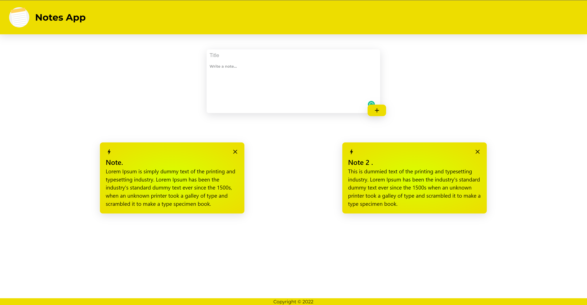

# React Notes App.

A note taking application made using react.

**live demo: [https://pranavelric.dev/Notes-app](https://pranavelric.dev/Notes-app)**


## Instructions

First clone this repository.
```bash
$ git clone https://github.com/pranavelric/Notes-app.git
```

Install dependencies. Make sure you already have [`nodejs`](https://nodejs.org/en/) & [`npm`](https://www.npmjs.com/) installed in your system.
```bash
$ npm install # or yarn
```

Run it
```bash
$ npm start # or yarn start
```

## Screenshots




